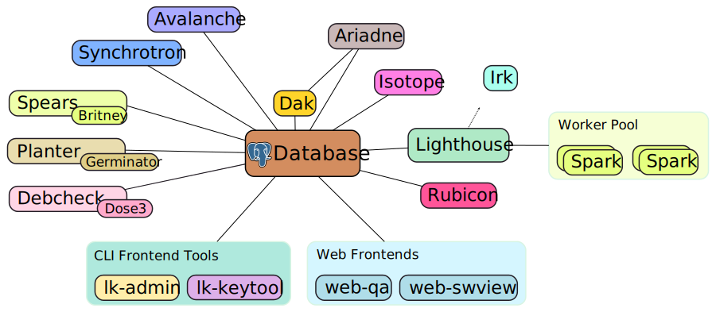

Laniakea
========

Laniakea is a software suite to manage Debian derivatives. It integrates tightly with `dak`, the [Debian Archive Kit](https://wiki.debian.org/DebianDak).
Laniakea is built using experience from prior solutions used to maintain the Tanglu Debian derivative, which uses a full
fork of the Debian archive and therefore needed to replicate a large portion of Debian's own infrastructure, including
multiple QA tools.

This software is currently in early development, and used by the PureOS Debian derivative. It's development is supported
by [Purism](https://puri.sm/).

Laniakea is based on the following principles:
 * Have one source for all configuration
 * Integrate components tightly, by making them speak the same protocols
 * Minimize human interventions when maintaining a derivative
 * Allow to manage most (all?) functions via a web interface
 * Fine-grained permissions for project members
 * No shell script glue
 * Reuse existing tools whenever possible, via wrappers

Its tasks include, but are not limited to:
 * Synchronizing packages from the source distribution with the target derivative
 * Migrating packages between suites using Britney2
 * Building disk images for the derivative
 * Validating installability of packages
 * Managing default package selections
 * Building packages
 * Automatically taking maintenance action on the archive (e.g. rebuilding packages)
 * Propagate information between the archive repository, bugtrackers and other websites
 * etc.

Laniakea uses a lot of tools already common in the workflow of a derivative's archive maintainer, but integrates them in a nice way.

##  Development

Laniakea is split into multiple parts which can act independently (but all speak the same protocols and share data).
That way, more security-sensitive bits can also be isolated out and run on different machines.

At the moment, not much documentation for Laniakea exists, and the project is used and tested internally. This is supposed to change
though, and at that point we will also have better information on how to contribute to the project.

That, of course, should not stop you from filing bugs or pull-requests right now.
